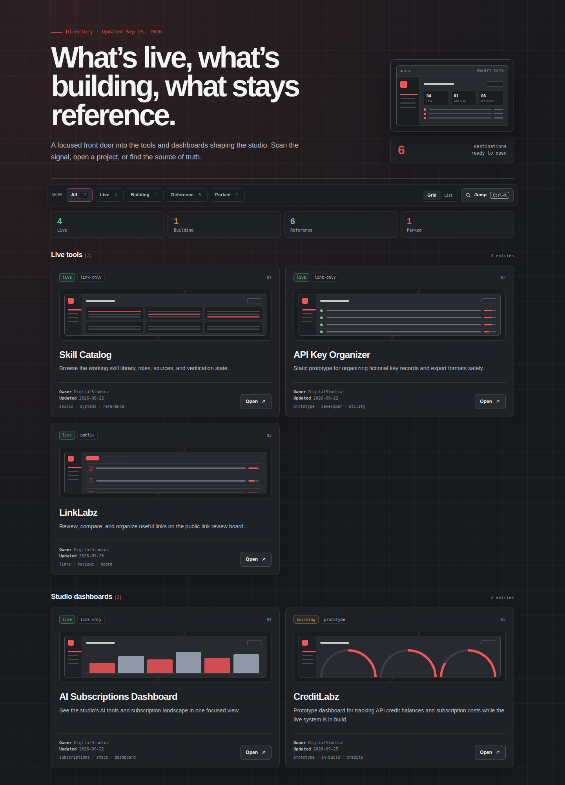

# ⚫ DigitalStudioz Hub — Charcoal Preview

> Jon's **DigitalStudioz Hub** rethemed in charcoal — the front door into the
> tools and dashboards shaping the studio, now in the dark charcoal + red
> direction that matches the CreditLabz restyle.

[](https://jonbeatz.github.io/digitalstudioz-hub-charcoal-preview/)
[](https://github.com/jonbeatz/digitalstudioz-hub-charcoal-preview/commits/main)
[](https://github.com/jonbeatz/digitalstudioz-hub-charcoal-preview)


**🚀 Live preview:** https://jonbeatz.github.io/digitalstudioz-hub-charcoal-preview/



> **Design preview.** A separate retheme branch of the Hub — the original
> artifact is untouched. Card links point at their live destinations.

## What's inside

- **12 destination cards** across four sections: Live tools, Studio
  dashboards, In progress, Reference.
- **New arrivals** — LinkLabz (Live tools, card 03) and CreditLabz (Studio
  dashboards, card 05, prototype/in-build label), both updated 2026-09-25.
  The older AI Subscriptions Dashboard stays in place.
- **Filter pills + Grid/List views** — filter by All / Live / Building /
  Reference / Parked, switch layouts per taste.
- **⌘K jump search** — command palette for hopping straight to a project.
- **Back-to-top button** — appears as you scroll down.
- **Charcoal theme** — dark charcoal base, dark charcoal buttons (no white
  buttons), no side color strokes, dashboard-style hero visual.

## Design language

Deep neutral charcoal (`#0a0b0d` / `#101214`), cool neutral grays, red as
the lead accent, gold kept to tiny accents. Dark charcoal controls
throughout. Manrope + IBM Plex Mono type pairing. Jon's locked website
taste: dark charcoal + grays with red or gold accents — no teal, aqua, or
purple.

## Tech stack

| Layer   | Choice                                                         |
| ------- | -------------------------------------------------------------- |
| Markup  | Single self-contained `index.html` (CSS + JS inlined)          |
| Runtime | None — opens straight in the browser, no build step            |
| Hosting | GitHub Pages, served from `main` (`.nojekyll`, no Jekyll pass) |
| Data    | Static card index; links point at live/public destinations     |

## Project structure

```text
digitalstudioz-hub-charcoal-preview/
├── index.html          # the whole hub — self-contained build
├── assets/
│   └── screenshot.png  # README hero shot (dark mode)
├── .nojekyll           # tell Pages to serve files as-is
└── README.md
```

## Workflow — branches, not overwrites

`main` always mirrors the latest approved build. Every change gets cut as a
**new branch** off `main` — no PRs unless Jon asks. Nothing is silently
replaced.

## Use this repo as a template

This README is the house pattern for Jon's preview repos. Copy the shape:
badges → live link → hero screenshot → what's inside → tech stack →
structure → workflow.

## Revision history

- 2026-09-25 — Initial charcoal export: full retheme of the Hub (charcoal
  base, red lead accent, dark buttons, no side strokes, dashboard hero,
  back-to-top), with the LinkLabz + CreditLabz cards included. Built from
  the Muse artifact `digitalstudioz-hub-charcoal-preview`.
